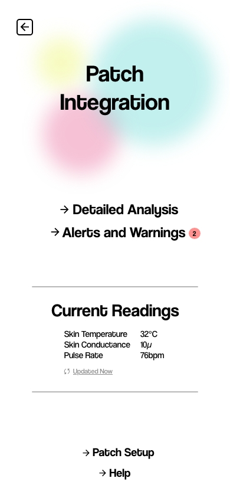

# Substance Use Disorder Treatment

Welcome to our project repository for the course "Integrating Design Technology and Business". This project aims to provide a novel solution for treating Substance Use Disorders (SUD) through an integrated approach, combining a wearable patch with a supportive mobile application.

## Project Overview

Substance Use Disorders represent a significant challenge in public health, with a cyclical nature of relapses significantly affecting recovery efforts. Our solution addresses these challenges by providing continuous monitoring and real-time feedback to both patients and healthcare providers.

## Solution Components

### The Wearable Patch
The wearable patch is a key component of our solution. It monitors various physiological parameters such as stress levels, heart rate, and skin temperature, which are crucial for predicting and preventing relapses.

### The Mobile Application
The mobile application receives data from the patch and presents it in an accessible format. It includes features for both patients and doctors:
- **Patient Dashboard**: Allows patients to monitor their progress and receive medication reminders.
- **Doctor Dashboard**: Enables doctors to track patient progress and adjust treatment plans accordingly.

## Key Features

- **Support Groups**: Facilitates connections among users with similar profiles.
- **Counsellor Connect**: Provides easy access to counselors and rehab centers based on the user's location.
- **Personal Tracking**: Includes features for tracking sober days and scheduling reminders for appointments and medication.
- **Immediate Help**: Offers a direct line to family or friends during severe cravings or mental hardships.

## Prototype

Here are some visuals from our prototype development:

## Analysis and Output

The following outputs showcase the data analysis capabilities and visualizations developed as part of our project:

## Development and Collaboration

This project is developed as a collaborative effort between students from diverse backgrounds in design, technology, and business. We are open to feedback and contributions to improve the solution.
